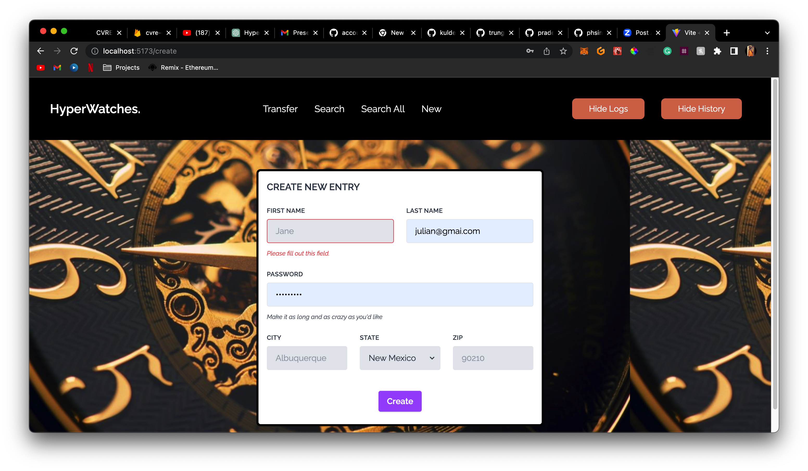
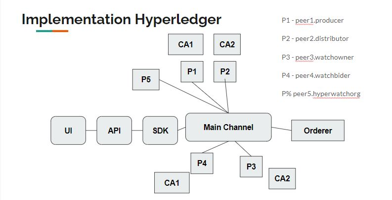

# HyperWatches

## Description 

HyperWatches is a blockchain-based marketplace for certified luxury watches. The platform leverages the power of Hyperledger Fabric to create a transparent and secure marketplace for buyers and sellers of luxury watches. 

## Requirements
Node.js (version 14 or higher)\
Docker (version 17.06.0 or higher)\
Docker Compose (version 1.22.0 or higher)\
Hyperledger Fabric binaries and Docker images (version 2.2.0)
## Installation

1. Clone the repository:
   ```bash
   git clone https://github.com/phsinghka/hyper_watches_fabric_node_react.git
   ```
2. Install the dependencies:
    ```bash
    cd backend
   npm install
   ```

## Usage

 `POST /create`\
 Create a new watch product.\
 Request body:

 ```json
{
  "watchId": "watch1",
  "brand": "Rolex",
  "model": "Submariner",
  "condition": "New"
}
 ```

  `POST /transfer`\
 Transfer ownership of a watch.\
 Request body:

 ```json
{
  "watchId": "watch1",
  "newOwner": "Alice"
}
 ```

 `GET /query/:watchId`\
Query an individual watch by ID.

`GET /queryAll`\
Query all watches in the ledger.

## Frontend



## Hyperledger Implemetation




## Roles and Responsibilities 

1. Piyush Rajkumar Himmatsinghka\
a. Develop and maintain the chaincode for the project\
b. Develop and maintain the Express server for the project

2. Julian Allende\
a. Ensure that the server adheres to best practices and standards\
b. Develop the business logic presentation
1. Yashkumar Kamleshbhai Patel\
a. Develop and maintain the client-facing UI for the project\
b. Ensure that the UI is user-friendly and meets the project requirements


